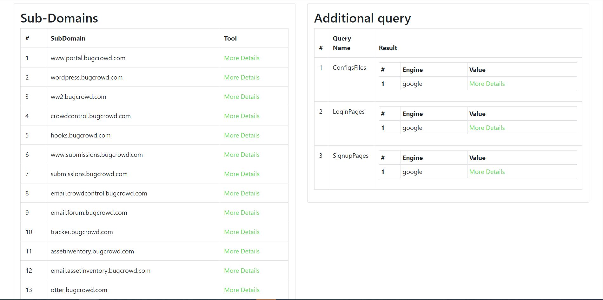

<br />
<p align="center">
  <a href="https://serpapi.com/">
    
  </a>

  <h3 align="center">SerpScan</h3>
</p>

<p align="center">
  <a href="https://github.com/Alaa-abdulridha/"></a>
  <a href="https://github.com/Alaa-abdulridha/"></a>

Serpscan is a powerfull  php script designed to allow you to leverage the power of dorking straight from the comfort of your command line.

</p>

## Table of Contents

- [Table of Contents](#table-of-contents)
- [About SerpScan](#about-SerpScan)
- [Features](#features)
- [Installtion](#Installtion)
- [Usage](#Usage)
- [Results](#Results)
- [Prerequisites](#prerequisites)
- [Environment tested](#environment-tested)
- [Credits](#credits)
- [Disclaimer](#disclaimer)

## About Serpscan

Serpscan is a powerfull php script designed to allow you to leverage the power of dorking straight from the comfort of your command line.

Serpscan offers powerfull use of (Google,Bing,Yahoo,Yandex,Badiu) search directives, by analyzing results from searches using multiple external tools.


You can run the  tool  in your PC or [VPS].

## Features
- Scan multiple domains
- Subdomain Enumeration
- Checks alive subdomain
- Finds URLs from all search engines
- Finds js files
- Search endpoints in js files
- Finds parameters
- Finds directories
- Export results in html,json
- You can customize you dorks in config file 

## Prerequisites

| **Name**          | **Repository**                                        |
| ----------------- | ----------------------------------------------------- |
| subfinder         |  https://github.com/projectdiscovery/subfinder        |                                     
| httpx             |  https://github.com/projectdiscovery/httpx            |                                               
| hakrawler         |  https://github.com/hakluke/hakrawler                 |                                              

## Installtion
1. git clone https://github.com/Alaa-abdulridha/SerpScan.git 
2. cd SerpScan
3. chmod 777 install.sh 
4. ./install.sh 

- You should add your SerpApi Key to the conf.php file 
- You can grab your key from [serpapi](https://serpapi.com/)
- Also you can add your dorks to the config file without any problems 

```javascript
<?php

require __DIR__ . '/vendor/autoload.php';
require __DIR__ . '/SAPI.class.php';

ini_set('max_execution_time', 0);
set_time_limit(0);
date_default_timezone_set('Asia/Riyadh');

$APIKey = 'API_KEY'

$outputPath = 'result';
$usePackage = true;

$domainsFile = 'domains.txt';

// query need to search , {{DOMAIN}} not change ever
$engine = [
	['google', 'q', [
		'subDomain' 	=> 'site:.{{DOMAIN}}', // not change key
		'SQLErrors'		=> 'site:{{DOMAIN}} intext:"sql syntax near" | intext:"syntax error has occurred" | intext:"incorrect syntax near" | intext:"unexpected end of SQL command" | intext:"Warning: mysql_connect()" | intext:"Warning: mysql_query()" | intext:"Warning: pg_connect()"',
		'PubDocum'		=> 'site:{{DOMAIN}} ext:doc | ext:docx | ext:odt | ext:rtf | ext:sxw | ext:psw | ext:ppt | ext:pptx | ext:pps | ext:csv',
		'PHP_Err_Warn'	=> 'site:{{DOMAIN}} "PHP Parse error" | "PHP Warning" | "PHP Error"',
		'PHP_INFO'		=> 'site:{{DOMAIN}} ext:php intitle:phpinfo "published by the PHP Group"',
		'DirLIstVuln'	=> 'site:{{DOMAIN}} intitle:index.of',
		'ConfigsFiles'	=> 'site:{{DOMAIN}} ext:xml | ext:conf | ext:cnf | ext:reg | ext:inf | ext:rdp | ext:cfg | ext:txt | ext:ora | ext:ini | ext:env',
		'PastingSites'	=> 'site:pastebin.com | site:paste2.org | site:pastehtml.com | site:slexy.org | site:snipplr.com | site:snipt.net | site:textsnip.com | site:bitpaste.app | site:justpaste.it | site:heypasteit.com | site:hastebin.com | site:dpaste.org | site:dpaste.com | site:codepad.org | site:jsitor.com | site:codepen.io | site:jsfiddle.net | site:dotnetfiddle.net | site:phpfiddle.org | site:ide.geeksforgeeks.org | site:repl.it | site:ideone.com | site:paste.debian.net | site:paste.org | site:paste.org.ru | site:codebeautify.org  | site:codeshare.io | site:trello.com "{{DOMAIN}}"',
		'DBFiles'		=> 'site:{{DOMAIN}} ext:sql | ext:dbf | ext:mdb',
		'SearchGit'		=> 'site:github.com | site:gitlab.com "{{DOMAIN}}"',
		'SearchStack'	=> 'site:stackoverflow.com "{{DOMAIN}}"',
		'LogsFiles'		=> 'site:{{DOMAIN}} ext:log',
		'BackupFiles'	=> 'site:{{DOMAIN}} ext:bkf | ext:bkp | ext:bak | ext:old | ext:backup',
		'LoginPages'	=> 'site:{{DOMAIN}} inurl:login | inurl:signin | intitle:Login | intitle:"sign in" | inurl:auth',
		'SignupPages'	=> 'site:{{DOMAIN}} inurl:signup | inurl:register | intitle:Signup',
	]],

	['baidu', 'q', [
		'subDomain' => 'site:.{{DOMAIN}}', // not change key
	]],

	['bing', 'q', [
		'subDomain' => 'site:.{{DOMAIN}}', // not change key
	]],

	['yahoo', 'p', [
		'subDomain' => 'site:.{{DOMAIN}}', // not change key
	]],

	['yandex', 'text', [
		'subDomain' => 'site:{{DOMAIN}}', // not change key
	]]
];

```

### Usage

php serpscan.php -d target .com -t html
| Flag             | Description                                                | Example                                |
| ---------------- | ---------------------------------------------------------- | -------------------------------------- |
| -d               | Domain to scan  subdomains for	                            | php start.php -d target.com        |
| -t               | The template of result (html,json)                         | php start.php -d target.com -t html|
| -w               | File containing list of domains to enumerate               | php start.php -d target.com  -w domains.txt -t html|

## Environment tested
CentOS  & Ubuntu By using the Install.sh

Windows 10, by manually installation.
## Results
<br />
<p align="center">
  <a href="https://serpapi.com/">
    
  </a>

## Credits

SerpScan  has been possible thank you to the following projects.

- [projectdiscovery](https://github.com/projectdiscovery)                                             
- [hakrawler](https://github.com/hakluke/hakrawler)         
- [LinkFinder](https://github.com/GerbenJavado/LinkFinder)               

## Disclaimer

- SerpScan was written for education purposes only.

